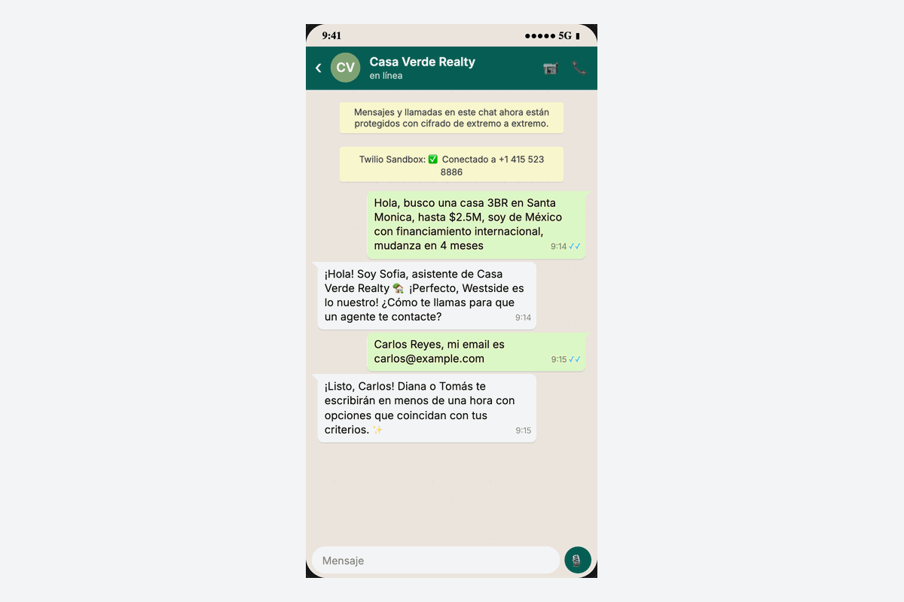
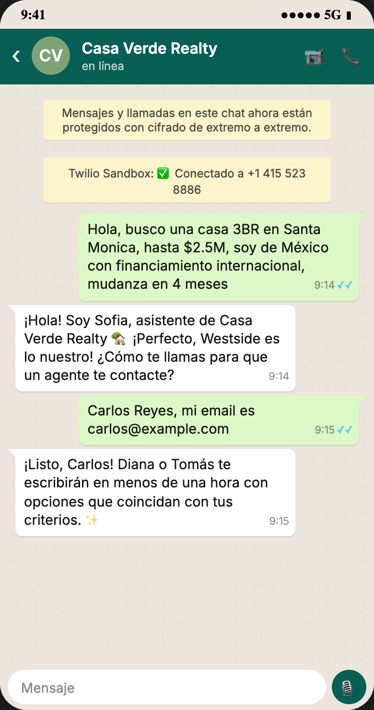
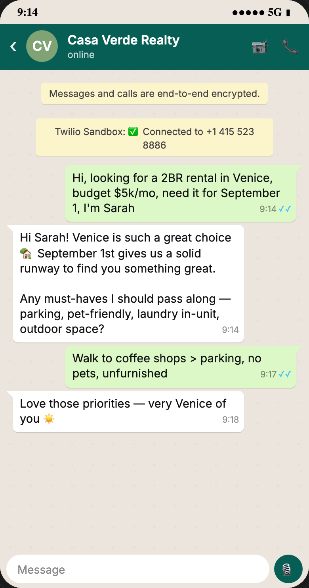
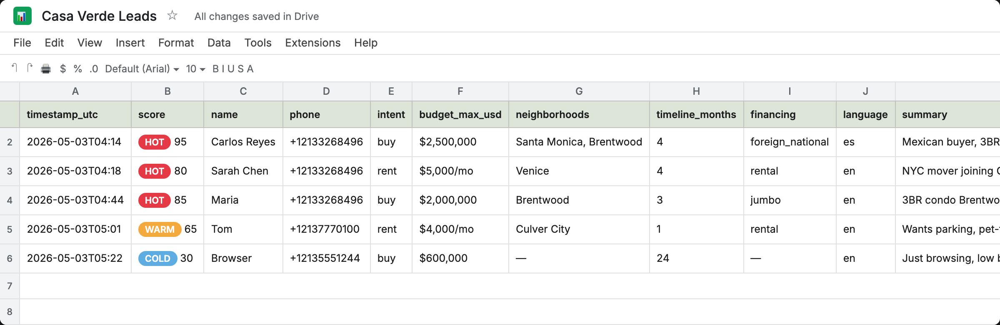
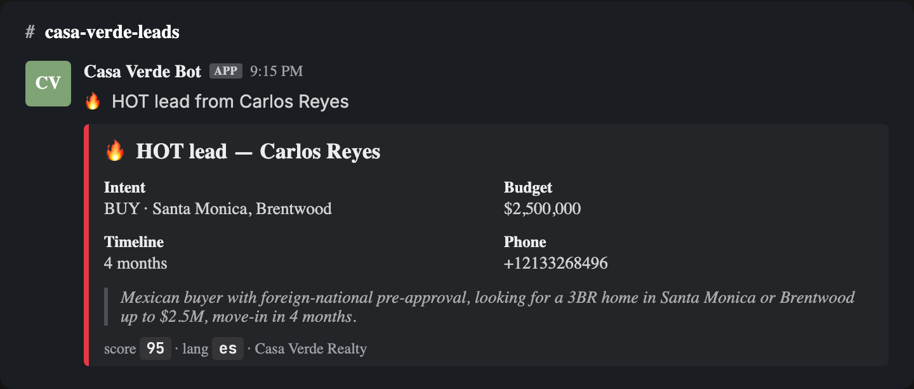

# Casa Verde Realty — WhatsApp AI Lead Bot

[](https://github.com/KirillHat/casa-verde-bot/actions/workflows/ci.yml)
[](https://www.python.org/downloads/)
[](https://fastapi.tiangolo.com/)
[](https://www.twilio.com/whatsapp)
[](https://www.anthropic.com/)
[](https://docs.google.com/spreadsheets/)
[](Dockerfile)
[](https://github.com/astral-sh/ruff)
[](LICENSE)

A production-ready **WhatsApp Business AI assistant** that auto-replies to inbound real-estate leads in **under 30 seconds**, qualifies them through a natural bilingual (English / Spanish) conversation, scores them with an LA-tuned rubric, and pushes the lead into Google Sheets + Slack.

Built around a fictional but realistic boutique agency — **Casa Verde Realty** (Santa Monica, CA) — see [`docs/case_study.md`](docs/case_study.md) for the full story and projected impact.

> Built as a portfolio piece to show how Claude + Twilio + a sane Python backend can replace a $5k/mo SDR for a small services business.

---

## 🎬 Demo

<p align="center">
  
</p>

## 📸 Screenshots

<table>
  <tr>
    <td align="center"><br/><sub>Spanish qualifier flow</sub></td>
    <td align="center"><br/><sub>English qualifier flow</sub></td>
    <td align="center"><br/><sub>Lead in Google Sheets</sub></td>
    <td align="center"><br/><sub>Slack notification</sub></td>
  </tr>
</table>

---

## ✨ Features

### Conversational
- **Bilingual** — auto-detects Spanish vs English on the first message and mirrors the prospect; switches mid-conversation if they switch
- **One question at a time** — short WhatsApp-native messages, never an essay
- **Natural** — uses the prospect's name once given, light emoji, no *"I am an AI assistant"* formality
- **Strict qualification flow enforced via Claude tool use** — no aimless small-talk; the LLM only finishes when it has enough info to call `record_lead`
- **Edge-case aware** — out-of-budget, casual browsing, hostile/spam, off-topic, existing-client all handled politely in the prompt

### Lead intelligence
- **Deterministic LA-tuned scoring** in pure Python — `HOT` / `WARM` / `COLD` based on budget tier, financing type, timeline urgency
- **Foreign-national premium** — recognizes Casa Verde's high-intent international segment
- **Rental vs purchase** — separate scoring lanes (a $5k/mo rental in Venice is HOT; a $5k home is COLD)

### Integrations
- **Twilio WhatsApp** — works out of the box with the free Sandbox; one env-var swap for production
- **Google Sheets CRM** — appends one row per qualified lead, auto-creates the header row on startup
- **Slack incoming webhooks** — Block Kit cards, score-based filtering (no ping for cold leads)
- **Anthropic Claude** with **prompt caching** on the system prompt — ~10× cheaper after the first call within the 5-minute window

### Production-grade
- **Async FastAPI** — webhook acks Twilio in <100 ms, processes in background
- **Signed Twilio webhook validation** — prevents anyone on the internet from forging messages
- **Structured logs (structlog) → JSON** — drops into any log aggregator
- **Sentry integration** — set `SENTRY_DSN` and you're done
- **SQLAlchemy 2.0 async + aiosqlite** — conversation memory survives restarts
- **Multi-stage Dockerfile** — ~120 MB final image, non-root user
- **GitHub Actions CI** — pytest matrix across Python 3.10 / 3.11 / 3.12 + ruff lint
- **`render.yaml`** — push to GitHub, deploy on Render free tier in 60 seconds

---

## 🏗 Architecture

```
WhatsApp ─► Twilio ─► /webhooks/whatsapp ─► (ack 200) ─┐
                                                        │
                                          background task
                                                        │
                                       ┌────────────────┼────────────────┐
                                       ▼                ▼                ▼
                                   Claude API      Google Sheets      Slack
                                  (qualify lead)   (CRM row)         (alert)
                                       │
                                       ▼
                              SQLite (conversation memory)
```

Full sequence diagram and component-by-component breakdown in [`docs/architecture.md`](docs/architecture.md).

---

## 🚀 Quickstart (10 minutes total)

### 1. Clone and install

```bash
git clone https://github.com/KirillHat/casa-verde-bot.git
cd casa-verde-bot
python -m venv venv && source venv/bin/activate
pip install -r requirements-dev.txt
```

### 2. Set up Twilio WhatsApp Sandbox

Follow [`docs/twilio_setup.md`](docs/twilio_setup.md) — 5 min, no Meta verification needed.

### 3. Set up Google Sheets

Follow [`docs/google_sheets_setup.md`](docs/google_sheets_setup.md) — 5 min, free.

### 4. Configure

```bash
cp .env.example .env
# Fill in TWILIO_*, ANTHROPIC_API_KEY, GOOGLE_SHEETS_ID, SLACK_WEBHOOK_URL
```

### 5. Run

```bash
uvicorn app.main:app --reload --port 8000
# in another terminal:
ngrok http 8000
# paste the https://xxx.ngrok.io/webhooks/whatsapp URL into Twilio Sandbox settings
```

### 6. Test

From your phone WhatsApp, message the Twilio sandbox number:

> *"Hi, looking for a 2BR rental in Venice, budget $5k/mo, need it next month"*

You should get an AI reply within 5 seconds, see a row appear in Google Sheets, and get a Slack notification.

---

## 🐳 Docker

```bash
docker compose up
```

Mounts `./data` for SQLite persistence and `./google_credentials.json` for Sheets auth.

---

## ☁️ Deploy to Render (free tier)

1. Push to GitHub
2. Render → New → Web Service → connect repo
3. Render auto-detects [`render.yaml`](render.yaml) and provisions the service
4. Set env vars in the Render dashboard (everything from `.env.example`)
5. Add `google_credentials.json` as a Secret File mounted at `/etc/secrets/google_credentials.json`
6. Set the Twilio Sandbox webhook to `https://your-app.onrender.com/webhooks/whatsapp`

---

## 🧪 Tests

```bash
pytest -v
# or with coverage:
pytest --cov=app --cov-report=term
```

The suite covers:

- **Scoring rules** — every HOT / WARM / COLD pathway, threshold overrides, foreign-national premium
- **Conversation flow** — mocked Claude responses, lead persistence, history threading, error isolation (Sheets failure ≠ user-facing failure)
- **Webhook** — signature validation, ack-fast behaviour, healthcheck

---

## 🔁 Adapting to a different vertical

The architecture is generic. To repurpose for a yoga studio, dental clinic, solar installer, online school, etc:

1. Edit [`app/prompts/qualifier_realestate.md`](app/prompts/qualifier_realestate.md) — domain context + qualification fields
2. Edit [`app/services/scoring.py`](app/services/scoring.py) — your industry's HOT / WARM / COLD rules
3. Update headers in [`app/services/sheets_client.py`](app/services/sheets_client.py) to match the new fields

Total adaptation time: **~2 hours**. The portability is the actual product — see [`docs/case_study.md`](docs/case_study.md#adapting-this-for-a-different-niche).

---

## 📚 Docs

- [`docs/case_study.md`](docs/case_study.md) — full Casa Verde story, projected metrics, why this is hard
- [`docs/architecture.md`](docs/architecture.md) — sequence diagram, component-by-component
- [`docs/twilio_setup.md`](docs/twilio_setup.md) — 5-minute sandbox setup
- [`docs/google_sheets_setup.md`](docs/google_sheets_setup.md) — service account + sheet
- [`upwork_description.md`](upwork_description.md) — copy-paste-ready Upwork portfolio entry

---

## 📝 License

MIT — see [`LICENSE`](LICENSE).

---

> Built by Kirill ([@KirillHat](https://github.com/KirillHat)).
> If you want this adapted to your business, [hire me on Upwork](https://www.upwork.com/freelancers/~kirhat).
